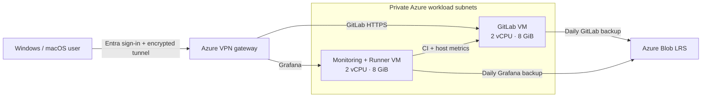

<p align="center"></p>

# cloudSphere · Your team's private GitLab workspace

Keep code, reviews, and delivery in one private workspace on Azure. cloudSphere brings together GitLab CE, a project CI Runner, monitoring, and daily off-VM backups in a small, understandable deployment.

Connect with Azure VPN Client, sign in with your assigned Microsoft Entra ID account, then open GitLab. Team members on supported **Windows and macOS** clients do not need personal VPN certificates. GitLab has its own account and project permissions.

## Start here

| You want to… | Read |
| --- | --- |
| Connect and work with your team's code | [User guide](docs/USER_GUIDE.md) |
| Set up VPN sign-in and approve users | [VPN administration](docs/VPN.md) |
| Install your own platform | [Deployment guide](docs/DEPLOYMENT_PLAN.md) |
| Maintain services and check backups | [Operations guide](docs/OPERATIONS.md) |
| Recover GitLab or Grafana | [Recovery guide](docs/runbooks/RESTORE.md) |
| Understand the design and decisions | [Architecture and ADRs](docs/SOLUTION_ARCHITECTURE.md) |

## What your team gets

- Private GitLab repositories, issues, merge requests, and Git over HTTPS.
- One Runner for one trusted project, running one job at a time with CPU and memory limits.
- Grafana access backed by Prometheus host metrics, retained for seven days.
- Daily GitLab and Grafana backups to Azure Blob, using managed identities instead of stored upload credentials.
- Terraform infrastructure, Docker Compose services, and documented manual recovery.


## Technology stack

| Area | Technology |
| --- | --- |
| Cloud | Microsoft Azure |
| Infrastructure as Code | Terraform |
| Source Control & CI/CD | GitLab CE, GitLab Runner |
| Containers | Docker, Docker Compose |
| Monitoring | Prometheus, Grafana, Node Exporter |
| Operating System | Ubuntu Linux |
| Networking | Azure VNet, NSG, VPN |
| Backup | Azure Blob Storage |
| Identity | Microsoft Entra ID |


## How it connects



The workload VMs have no public IPs. The VPN gateway has a public endpoint; backup traffic uses the authenticated public Blob endpoint. Administrators reach VM SSH through the VPN.

## For administrators

The reference installation uses two Ubuntu 22.04 VMs, four vCPUs total, and 8 GiB RAM per VM. GitLab has a 128-GiB data disk; monitoring and the Runner share a 64-GiB data disk. Existing OS disks are retained.

Prepare local configuration, supply your own values, then follow the [deployment guide](docs/DEPLOYMENT_PLAN.md):

```bash
cp terraform/terraform.tfvars.example terraform/terraform.tfvars
cp deploy/gitlab/.env.example deploy/gitlab/.env
```

You need an Azure subscription and Entra tenant, permission to configure the VPN application, an administrator SSH key, DNS, and trusted GitLab HTTPS. Enable Entra using the VPN guide. Terraform also requires a public VPN root certificate for its retained legacy authentication path; Windows/macOS users sign in through Entra.

| Directory | Contents |
| --- | --- |
| `terraform/` | Network, VPN, two VMs, disks, Blob storage, and backup identities |
| `deploy/` | Compose services, monitoring configuration, and a CI acceptance job |
| `scripts/` | Host tools, safe disk preparation, and application backups |
| `docs/` | User, administrator, architecture, and recovery guides |

## Know the limits

This reference targets small teams and has no high availability or guaranteed recovery time. Native Linux, mobile VPN clients, and certificate-based user onboarding are outside this release. WSL requires separate checks from inside its development shell.

GitLab and Grafana use local accounts, separately from Entra VPN sign-in. CI accepts only a trusted project's jobs. Monitoring collects host metrics; dashboards must be created or imported, and alert delivery and GitLab availability probes are not configured. HTTPS renewal is currently manual. Verify outbound connectivity before installation and backup uploads: this configuration does not provision explicit egress.

Daily successful backups target about 24 hours of potential data loss. Same-region LRS does not protect against a whole-region outage. Test recovery before relying on it, and review pinned software versions before deployment or upgrades.

Run the deployment acceptance checks for your installation and keep the results privately. For source releases, follow the [publishing guide](docs/PUBLISHING.md).

## License

[MIT](LICENSE). Deployed products retain their own licenses.
