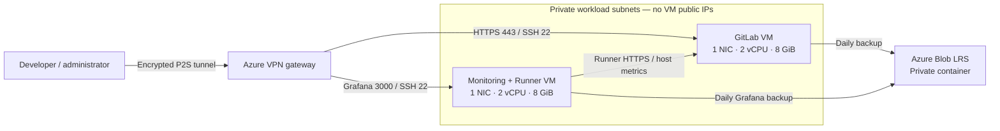

# cloudSphere: Private GitLab on Azure

A bootcamp reference implementation of a private GitLab platform using Terraform and Docker Compose. Two Azure VMs share a four-vCPU budget: one hosts GitLab CE; the other hosts monitoring and a single project Runner.

The repository contains reusable configuration and operating instructions. Deployment credentials, live resource identifiers, screenshots, and private verification records are excluded. Run the acceptance checks for your own installation; publishing these files does not deploy or validate a platform.



## Read the design

- [Solution architecture and ADRs](docs/SOLUTION_ARCHITECTURE.md): topology, NICs, network boundaries, storage, tradeoffs, and recovery.
- [Deployment runbook](docs/DEPLOYMENT_PLAN.md): preparation, installation order, and acceptance checks.
- [VPN access](docs/VPN.md): certificate access and optional Entra authentication.
- [Recovery runbook](docs/runbooks/RESTORE.md): complete GitLab restore and Grafana recovery.
- [Publishing guide](docs/PUBLISHING.md): public file boundary and release checks.

## What is included

| Path | Purpose |
| --- | --- |
| `terraform/` | VNet, VPN gateway, two NICs, two VMs, NSGs, disks, Blob storage, and backup identities |
| `deploy/gitlab/` | GitLab CE and host Node Exporter |
| `deploy/monitoring/` | Prometheus, Grafana, host Node Exporter, and project Runner |
| `scripts/` | Host tools, safe disk preparation, GitLab and Grafana backups |
| `deploy/runner-smoke.gitlab-ci.yml` | A real CI job that checks execution limits and produces an artifact |

## Prepare your configuration

You need an Azure subscription, Azure CLI authentication, Terraform compatible with the locked provider, an SSH key, VPN certificates, and a hostname with trusted TLS. Host installation expects Ubuntu 22.04, Docker Engine, and the Compose plugin. Commands assume Bash and the default example administrator `azureadmin`; adapt it if you change that variable.

```bash
cp terraform/terraform.tfvars.example terraform/terraform.tfvars
cp deploy/gitlab/.env.example deploy/gitlab/.env
```

Replace the example values, then follow the deployment runbook. The addresses `10.0.0.0/16` and `172.16.100.0/24` are the reference network layout. Change them consistently across Terraform, Compose, Prometheus, and your client routes if they overlap an existing network. `gitlab.internal.example.com` is a placeholder, not a service operated by this project.

## Scope and limitations

This is a small, single-region installation without high availability. Each VM has two vCPUs and 8 GiB RAM, with separate 128-GiB GitLab and 64-GiB monitoring data disks. CI is limited to one trusted project and one job at a time. The Runner controller uses the host Docker socket; it is unsuitable for untrusted public contributions.

GitLab and Grafana are reached through the VPN. The VPN gateway has a public endpoint, and Blob uploads use the authenticated public Azure Storage endpoint. No explicit outbound route is provisioned; verify egress before package downloads, image pulls, or backups. Same-region LRS backups do not cover a whole-region outage. Image versions are pinned for reproducibility; review upstream support and security releases before deploying or upgrading them.

## License

[MIT](LICENSE). GitLab, Grafana, and the other deployed products retain their own licenses.
