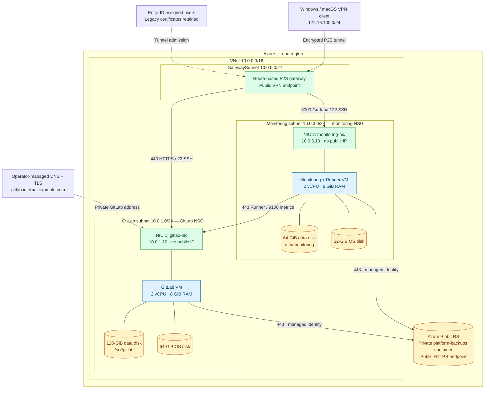
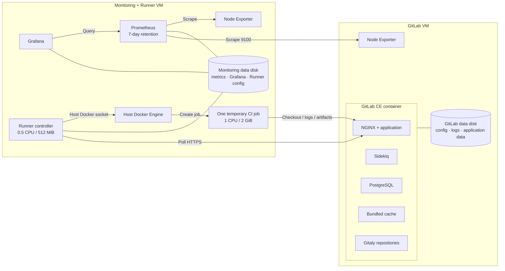
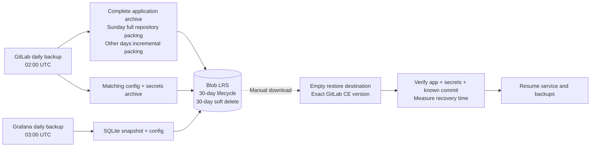
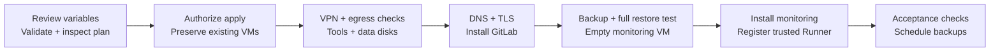

# cloudSphere solution architecture

This document describes the reference configuration. Network addresses define the reusable private layout; hostnames and deployment identifiers are examples. Validate each installation using the deployment guide, and keep its inventory and acceptance results privately.

## 1. Goals and constraints

Provide private source control, merge requests, one trusted CI workload, host monitoring, and recoverable application data for a small team's workspace. This bootcamp reference uses Terraform and Docker Compose, within **two VMs, four vCPUs total, and 8 GiB RAM per VM**.

The product access path is Azure VPN Client with Entra ID sign-in for assigned users on supported Windows and macOS clients. Native Linux and mobile VPN access are outside this release. WSL is conditional on checks inside that environment. Legacy certificate authentication remains in the infrastructure during migration; users do not need personal VPN certificates for the supported Entra path.

GitLab uses local accounts and Git over HTTPS. Grafana uses local login. VPN admission and application authorization are separate. Kubernetes, extra VMs, high availability, automatic failover, a second region, and additional monitoring services are outside this release.

## 2. Network and infrastructure

**Two workload NICs total, one attached to each VM.** The gateway has its own gateway IP configuration; it is not an extra VM NIC. Terraform declares both NICs in `compute.tf`. Resource groups organize resources but are not network security boundaries. NSGs attach to the workload subnets.

| Resource | Configuration |
| --- | --- |
| Region | Operator-selected; example default `eastus` |
| GitLab VM | `Standard_D2as_v7`; Ubuntu 22.04; static private IP `10.0.1.10` |
| Monitoring VM | `Standard_D2ds_v7`; Ubuntu 22.04; static private IP `10.0.3.10` |
| VPN | `VpnGw1AZ`, route-based P2S; pool `172.16.100.0/24` |
| Product VPN access | Dedicated Entra app with assigned Windows/macOS users; OpenVPN |
| Current Terraform compatibility | Unset Entra audience yields certificates/IKEv2/OpenVPN; supplying the audience enables Entra + certificates/OpenVPN; root certificate input remains required |
| Persistence | Existing OS disks plus Standard SSD LRS data disks attached at LUN 0 |
| Backup service | Standard Blob LRS, private container, user-assigned managed identities |

Verify the chosen VM sizes are available within the subscription's regional quota. A gateway SKU supporting zones does not make this two-VM application highly available.

### Access and exposure

| Initiator | Destination | Port | Purpose |
| --- | --- | --- | --- |
| VPN client pool | GitLab VM | TCP 443 | Web interface and Git clone/push |
| VPN client pool | Both VMs | TCP 22 | SSH administration using authorized keys |
| VPN client pool | Monitoring VM | TCP 3000 | Grafana HTTP inside the encrypted VPN |
| Monitoring subnet | GitLab VM | TCP 443 | Runner polling, checkout, logs, and artifacts |
| Monitoring subnet | GitLab VM | TCP 9100 | Node Exporter host metrics |
| Grafana container | Prometheus container | TCP 9090 | Internal Compose network data source |
| Prometheus container | Monitoring host | TCP 9100 | Local host metrics |
| Each VM | Azure Blob | TCP 443 outbound | Authenticated backup uploads/downloads |

The subnet NSGs allow these inbound paths, then deny other VNet inbound traffic. The VPN pool's SSH rule permits network reachability for all VPN users; SSH keys determine who can log in. There is no per-user network segmentation. Node Exporter binds to each VM's private IP. Prometheus publishes its host UI only at `127.0.0.1:9090`. No inbound Runner port is needed.

The workload VMs have **no public IPs**. The VPN gateway does have a public endpoint. Blob public network access is not disabled: the container requires authorization and public blob access is prohibited, but there is no private endpoint or storage firewall in this configuration. Both identities have container-scoped read/write/delete access, not upload-only access.

DNS must resolve the operator's GitLab hostname to `10.0.1.10` from VPN clients, the monitoring host, and CI containers. Public DNS can disclose a hostname even when its address is private. Use trusted TLS with DNS validation or an operator-managed CA; HTTP validation cannot reach this private GitLab endpoint.

**Outbound routing is a prerequisite.** Terraform defines no explicit egress service or VM public IP. NSG allowances do not create an outbound route. Verify actual DNS and HTTPS access to package repositories, registries, and Blob before installation. If an explicit egress mechanism is needed, review that infrastructure change separately.

## 3. Services and persistent data

GitLab retains its required database, cache, repository service, web application, and background jobs. Its Compose settings use a single Puma process and Sidekiq concurrency 10. Bundled monitoring/exporters, Alertmanager, KAS, and the container registry are disabled. The independent Node Exporter remains enabled on each host.

Prometheus scrapes itself and both Node Exporters every 30 seconds. It provides host metrics, not application availability probes or alert notifications. Grafana stores its SQLite database on the monitoring data disk. Alertmanager, cAdvisor, and Blackbox Exporter are deferred.

The Runner uses the Docker executor for **one trusted project**, with global `concurrent = 1` and runner `limit = 1`. Privileged jobs and privileged services are disabled. Registration and access restrictions are operator steps: use protected refs, the `bootcamp` tag, and disable untagged jobs. The controller's host Docker socket grants substantial host control; job containers must not inherit it. Resource caps limit contention but do not provide a safe boundary for hostile CI definitions.

Data mounts are `/srv/gitlab/{config,logs,data}` and `/srv/monitoring/{prometheus,grafana,runner,secrets,backups}`. Docker images, container layers, and CI cache volumes use the host Docker data directory on the OS disk; monitor OS disk usage as well as data disk usage. Disk preparation accepts a stable by-id device, checks existing signatures and all bytes before formatting an empty disk, and refuses to hide files under an unmounted mount directory.

Compose service stdout/stderr uses explicit Docker log rotation: 10 MiB per file and three files per container. This does not cap GitLab internal logs, backup cron logs, CI job logs, image layers, or cache volumes. Applying this setting to existing containers requires an authorized recreation. See the [operations guide](OPERATIONS.md) for checks and maintenance.

## 4. Backup and manual recovery

Only Git repository packing is incremental; each uploaded application archive remains a complete restore point. Its matching configuration/secrets archive is also required. Restore uses the exact GitLab CE version that created the archive. These requirements follow the [GitLab backup](https://docs.gitlab.com/administration/backup_restore/backup_gitlab/) and [restore](https://docs.gitlab.com/administration/backup_restore/restore_gitlab/) procedures.

Both scripts check free space, prevent overlapping executions, upload using their VM's managed identity, and atomically update success markers only after all uploads succeed. GitLab selects its incremental predecessor from that success record and keeps the latest successful application archive locally. A missing local predecessor forces full packing; a malformed record stops the run for inspection. Failed runs may leave files for investigation but are not selected as predecessors. Capacity estimates are approximate; monitor growth and resolve failures before the next run. Upload retries, a remote completion manifest, and automatic failure notifications are not implemented.

Grafana uses SQLite's `.backup` for a consistent database copy and archives the provisioned configuration. Prometheus's seven days of metrics are not backed up. Re-register Runner after a host rebuild. Store Terraform state, administrator SSH keys, VPN CA material, and recovery credentials separately from Git and from these application backups.

The 30-day lifecycle expires base blobs. Soft delete then retains recoverable deleted blobs/containers for its configured window; this is not an exact 30-day maximum lifetime. Storage roles can delete data, and these backups are not immutable. Application and secrets archives share a container: separate files aid restoration but do not provide separate authorization boundaries.

**RPO target:** about 24 hours if daily backups succeed. **RTO:** measure during a full restore; no recovery duration is promised. Same-region LRS does not protect against a whole-region outage. Before installing monitoring, test a complete GitLab restore on its empty VM, verify the known repository/commit and secrets, and remove the temporary data. After monitoring is installed, that VM is not an available standby. Repeat full restore verification for major upgrades with a separately reviewed recovery arrangement that respects the compute limit.

## 5. Deployment and verification

Follow the [deployment runbook](DEPLOYMENT_PLAN.md), [VPN administration guide](VPN.md), [operations guide](OPERATIONS.md), and [recovery runbook](runbooks/RESTORE.md). Send team members the [user guide](USER_GUIDE.md). For an existing deployment, review a fresh plan for no VM replacement or destruction and no increase beyond four vCPUs. For a new installation, expect the two defined VMs to be created. Never apply this configuration to existing resources with missing state without first reconciling ownership/imports.

Static validation checks file syntax and provider configuration. Deployment means resources exist. Installation means services are running. Verification additionally requires VPN HTTPS login, clone/push, a successful real Runner job and downloaded artifact, all three Prometheus targets UP, Grafana access, matching backup uploads, and the complete initial restore. Keep evidence privately; none of those runtime results is established by the public source alone.

## 6. Architecture decision records

These decisions are accepted for the reference design unless marked conditional. The rationale and consequences describe the small installation's tradeoffs; they are not claims of production availability.

### ADR-001 — Terraform and Docker Compose

**Context:** The project needs reviewable Azure resources and an understandable service installation. **Decision:** Terraform owns Azure resources; Compose owns containers on Ubuntu VMs. **Consequences:** Operators manage host patching, service upgrades, and ordering. Kubernetes and extra orchestration would add complexity outside the bootcamp scope.

### ADR-002 — Two VMs and two workload NICs

**Context:** The compute budget is four vCPUs. **Decision:** Give GitLab and monitoring/Runner separate two-vCPU, 8-GiB VMs, each with one private NIC in its own subnet. **Consequences:** CI does not execute on the GitLab host, but CI and monitoring compete for resources. There is no dedicated Runner VM or redundant application instance.

### ADR-003 — VPN access without public workload IPs

**Context:** Users and administrators need remote access to private services. **Decision:** Use one P2S VPN gateway; keep VM NICs private. **Consequences:** The gateway remains publicly reachable, and clients need working routes and DNS. A tunnel does not grant application permissions.

### ADR-004 — Entra VPN admission for Windows and macOS

**Context:** Team members need account-based access without managing personal certificates. **Decision:** Use a dedicated Entra audience with required assignment for supported Windows/macOS Azure VPN Client users. Native Linux/mobile access is outside this release; WSL needs separate verification. Retain the current Terraform certificate path during migration. **Consequences:** Operators must supply the Entra audience to enable the product path; unset variables still produce the historical certificate mode. Removing that mode is a separate reviewed configuration change. Entra sign-in does not itself enforce MFA or application SSO.

### ADR-005 — Explicit subnet NSG paths

**Context:** Azure's default VNet access is broader than required. **Decision:** Allow the listed VPN, Runner, and metrics flows, then deny other VNet inbound traffic. **Consequences:** All admitted VPN users can reach service ports and SSH, subject to application/key authorization. This release has no separate administrator VPN segment.

### ADR-006 — Local service accounts and HTTPS Git

**Context:** Central application SSO and Git SSH add configuration beyond this release. **Decision:** Use GitLab and Grafana local accounts; use HTTPS for Git and reserve port 22 for VM administration. **Consequences:** Operators manage service accounts separately from VPN membership and remove both when offboarding users.

### ADR-007 — Separate managed data disks

**Context:** Application state must survive container recreation without replacing existing VMs. **Decision:** Attach 128-GiB GitLab and 64-GiB monitoring data disks at LUN 0, retaining existing OS disks. **Consequences:** Mount verification is essential before starting containers. Disk persistence is not a backup, and Docker's OS-disk usage still needs monitoring.

### ADR-008 — Bundled GitLab dependencies, reduced optional services

**Context:** GitLab must fit a small VM. **Decision:** Keep PostgreSQL, the bundled cache, Gitaly, and required application services; disable optional bundled monitoring, KAS, and registry. **Consequences:** There are fewer supported features and less application telemetry. Capacity must be measured under the actual workload.

### ADR-009 — Minimal host monitoring

**Context:** Monitoring shares the Runner VM. **Decision:** Use Prometheus, Grafana, and Node Exporter, with seven-day metrics retention and a loopback-only Prometheus host UI. **Consequences:** No configured alert delivery, container telemetry, or synthetic checks. Losing the metrics disk loses short-lived history; it is rebuilt rather than backed up.

### ADR-010 — One trusted project Runner

**Context:** CI needs Docker jobs without exhausting monitoring capacity. **Decision:** One project runner, one job at a time, 1 CPU/2 GiB per job, no privileged mode; controller capped at 0.5 CPU/512 MiB. **Consequences:** The controller's Docker socket is a host-control capability. Only trusted maintainers may define jobs; this is not a public multi-tenant CI service.

### ADR-011 — Blob LRS backups using managed identities

**Context:** Off-VM backups must avoid committed storage credentials. **Decision:** Use a private Blob container, one managed identity per VM, container-scoped Blob Data Contributor, a 30-day lifecycle, and soft delete. **Consequences:** Uploads use a public authenticated endpoint. Both identities can read and delete shared-container backups; LRS is neither immutable nor regional disaster protection.

### ADR-012 — Complete restore points with incremental repository packing

**Context:** Daily archives should remain independently restorable while reducing repeated repository packing. **Decision:** Full GitLab repository packing Sunday, incremental packing on other days from the recorded last successful local archive, separate matching secrets/config uploads, and daily Grafana database/config backups. Update local success records atomically after both uploads. **Consequences:** Failed-upload archives do not become predecessors. Missing local predecessors force full packing; failed uploads still need operator investigation and a new run. Prometheus is excluded.

### ADR-013 — Manual recovery and a mandatory restore drill

**Context:** There is no capacity for a permanent standby. **Decision:** Test the first full restore on the empty monitoring VM before monitoring installation; use manual recovery and repeat full verification for major upgrades. **Consequences:** Recovery consumes operator time and requires the exact GitLab CE version and matching secrets. Measure recovery time instead of promising an untested RTO.

### ADR-014 — Verify egress instead of assuming it

**Context:** Private NICs and permissive outbound NSGs do not ensure an Internet route. **Decision:** Treat usable outbound connectivity as a verified deployment prerequisite. **Consequences:** Stop before installation if it is absent; any additional egress infrastructure needs a separate scope decision. These files alone do not constitute a complete outbound network design.

### ADR-015 — Pinned software with reviewed upgrades

**Context:** Installation and recovery need reproducible component versions. **Decision:** Commit the Terraform provider lock file and explicit service image tags. **Consequences:** Pins require maintenance and do not imply current security support. Review release notes, follow supported upgrade paths, and retain the exact image version needed for a restore.

### ADR-016 — Public source, private deployment records

**Context:** Readers need the design and operating procedures without access to one operator's deployment. **Decision:** Publish source, placeholder examples, this SAD, ADRs, and current code-based diagrams under MIT. Exclude credentials, state, private identifiers, screenshots, and deployment evidence. **Consequences:** Public readers must validate their own installation. A clean export avoids carrying personal Git metadata; publication does not make deployed services public.

### ADR-017 — Bounded Compose service logs

**Context:** Docker stdout/stderr can fill small OS disks. **Decision:** Configure `json-file` rotation at 10 MiB with three files for every Compose service. **Consequences:** Old container log history expires; internal application logs, CI jobs, images, and caches still require maintenance. Existing containers need authorized recreation before this setting takes effect.
